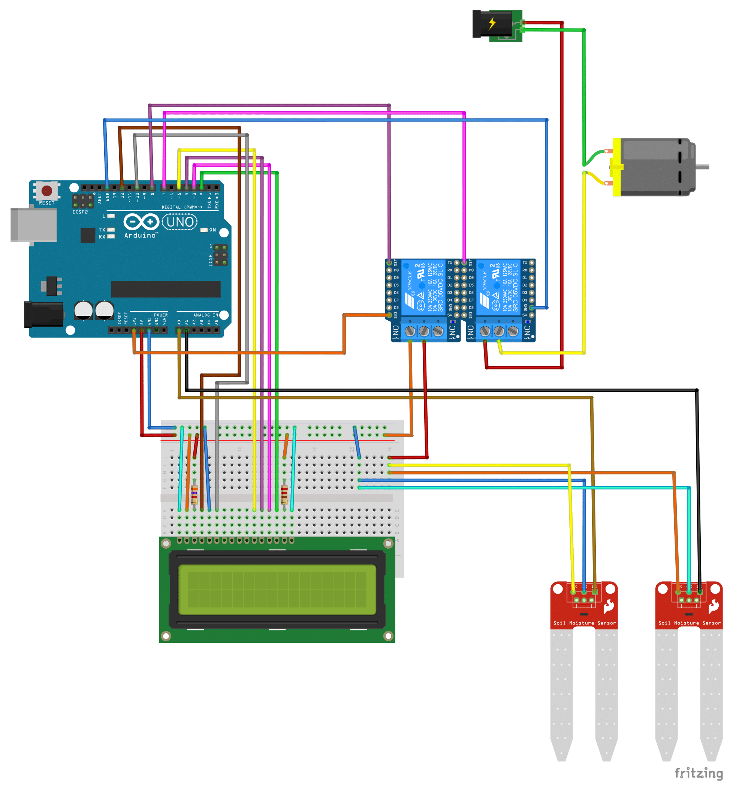

`hydrobot`
=======================
Automatic plant watering system using Rust and Arduino Uno.

Once every 24 hours, the system will check the plant's pot for a duration of 3 seconds and water the plant if deemed suitable.

2 sensors are connected to the Arduino, one which measures the moisture of the plant's soil and one which measures the water level in the tray below the pot. There are 3 scenarios:
 - If the moisture sensor sends a too low value to the Arduino, no watering will take place. This is because it indicates that the sensor isn't placed in some conducting surrounding (soil) or is faulty.
 - If the moisture sensor sends a too high value, or the water level sensor in the tray sends a too high value, no watering will take place. This indicates that the soil is moist enough or that water has ended up in the tray, with further watering risking flooding.
 - If the moisture sensor sends a value between the two levels mentioned in previous steps, and the water level sensor in the tray sends a low enough value, watering will take place. The pump will be turned on for a pre-set amount of time.

Upon powering up the system, it will start by checking the plant's pot (and potentially watering the plant), before going to standby. Information will be diplayed on the connected LCD, such as the result from the pot measurements and time left until the next measurement.

# Usage

## Flashing to Arduino
 - First, you need to install Rust (<https://www.rust-lang.org/tools/install>)
 - Second: For Linux or Mac, use this guide to install the necassary tools: <https://book.avr-rust.com/002.1-installing-required-third-party-tools.html>; for Windows, go to the next step and see what tools you are missing, find them and set their paths' as environment variables.
 - Then, install `ravedude`:
 ```bash
 cargo install ravedude
 ```

To flash the Arduino, run
```bash
cargo run
```
in the project root directory. You may need to manually set the port. Either use the Arduino app from arduino.cc to find it, or check it with suitable command, then set it by following the instructions of `ravedude`. This information can be set in `.cargo/config.toml`.

## Building the hardware
The diagram below depicts the complete circuit diagram of the watering system.
<div align="center">
  
  <p>
    <i>Circuit diagram of system.</i>
  </p>
</div>

Sensors and pump were bought from Whadda. The chip is an Arduino Uno, but other models of Arduino should work too. The LCD is a HITACHI HD44780. The resistor leading to the 3rd of the LCD is 4.7 $\mathsf{k\Omega}$ and the one leading to the 15th is 220 $\mathsf{k\Omega}$.

A solderless breadboard is depicted in the circuit diagram, but this is only done for illustrative reasons. The finished system should be connected in a more robust way.

## Calibrating the system
The system can be tuned by changing how much water the pump approximately moves in mililiters per milisecond, how much water which is to be pumped, for how long time the sensors are to be active per cycle, the lower and upper limits of the moisture sensor, the limit of the water level sensor, and the time between cycles.

## Using other AVR-chips
If the code is to be flashed to another kind of AVR-chip than that of Arduino Uno (ATmega328P), json files corresponding to other chips are available in the `avr-specs/` directory. Target platform can be changed in `.cargo/config.toml` by setting `target` under the `build` section to the chip's json file.

# Tools used for project
## Code
`hydrobot` is built using tools, crates, json files and template from [Rahix](https://github.com/Rahix). It also uses the crate [ag-lcd](https://github.com/mjhouse/ag-lcd) to control the LCD.

## Circuit diagram
Circuit diagram was made using Fritzing. Editable file located at `assets/circuit_diagram.fzz`.

# License
Licensed under GNU General Public License, Version 3.0.